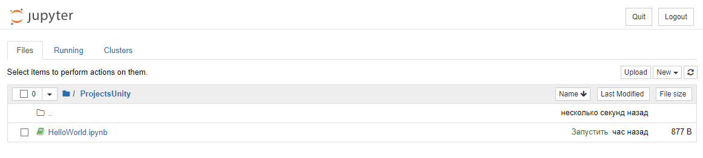
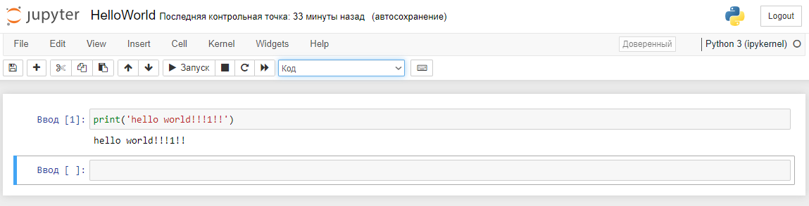
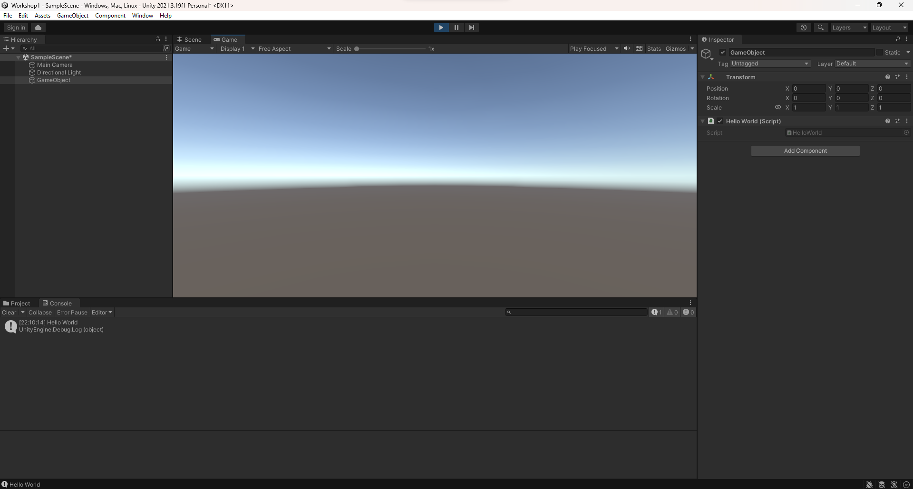

# АНАЛИЗ ДАННЫХ И ИСКУССТВЕННЫЙ ИНТЕЛЛЕКТ [in GameDev]
Отчет по лабораторной работе #1 выполнил:
- Бушуев Дмитрий Эдуардович
- РИ220944
Отметка о выполнении заданий (заполняется студентом):

| Задание | Выполнение | Баллы |
| ------ | ------ | ------ |
| Задание 1 | * | 60 |
| Задание 2 | * | 20 |
| Задание 3 | * | 20 |

знак "*" - задание выполнено; знак "#" - задание не выполнено;

Работу проверили:
- к.т.н., доцент Денисов Д.В.
- к.э.н., доцент Панов М.А.
- ст. преп., Фадеев В.О.

[](https://nodesource.com/products/nsolid)

[](https://travis-ci.org/joemccann/dillinger)

Структура отчета

- Данные о работе: название работы, фио, группа, выполненные задания.
- Цель работы.
- Задание 1.
- Визуализация результатов выполнения.
- Задание 2.
- Код реализации выполнения задания. Визуализация результатов выполнения.
- Выводы.

## Цель работы
Установить необходимое программное обеспечение, которое пригодится для создания интеллектуальных моделей на Python. Рассмотреть процесс установки игрового движка Unity для разработки игр. Написать программу на Python и скрипт для Unity

## Задание 1
### Пошагово выполнить каждый пункт раздела "ход работы" с описанием и примерами реализации задач
Ход работы:
- Создать папку для проектов в Jupyter.



- Написать программу Hello World на Python с запуском в Jupiter Notebook.



## Задание 2
### Написать программу Hello World на C# с запуском на Unity.
Ход работы:
- Создать GameObject на пустой сцене.
- Создать скрипт и написать в нём код.

```cs

using UnityEngine;

public class HelloWorld : MonoBehaviour
{
    void Start()
    {
        Debug.Log("Hello World");
    }
}

```

- Привязать скрипт к объекту GameObject.

- Запустить игру.



## Выводы

Скачал Anaconda и Unity. Создал папку для проектов и файл python в Jupyter. Создал проект в Unity и написал скрипт, который выводит "Hello World" в консоль.

## Powered by

**BigDigital Team: Denisov | Fadeev | Panov**
